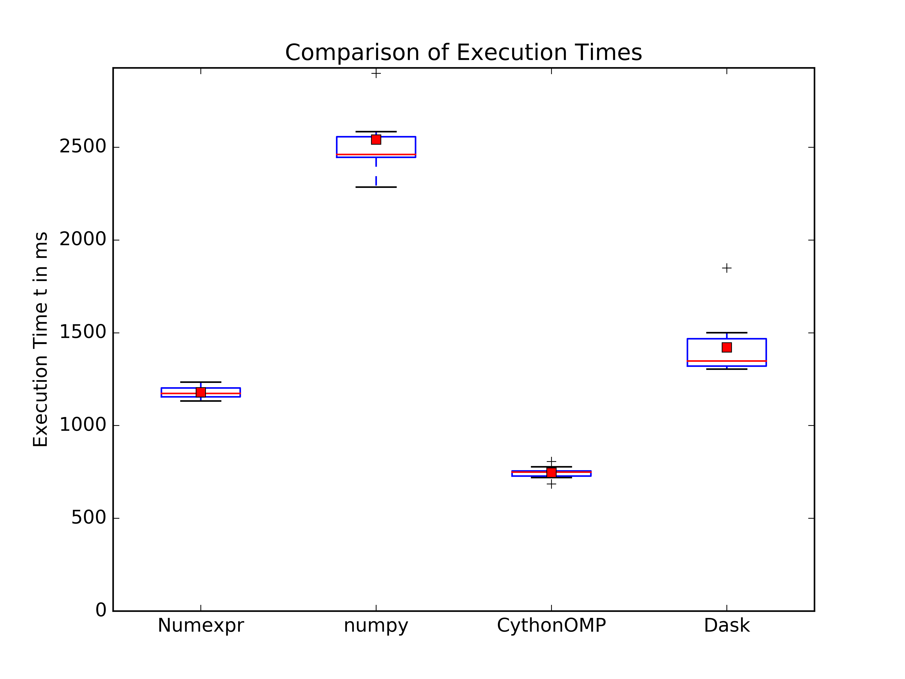

Example Code Comparing Dask With Other Implementations
======================================================

Rough execution times of an algorithm in dask, numexpr, parallelized Cython,
etc.  Build Cython code with::

    python setup.py build_ext --inplace

Code can be run with ``py.test``. Note that the
``tearDownClass`` method of the tests will write out two
files with a plot of execution times, comparison.pdf and comparison.png.

I added the products of one test run on my laptop to this repository.

Building on MacOS
-----------------

On MacOS, you must use the gcc instead of Clang to compile the openmp code. You
can specify it by setting the ``CC`` environment variable. I use::

        CC=/usr/local/bin/gcc-6
